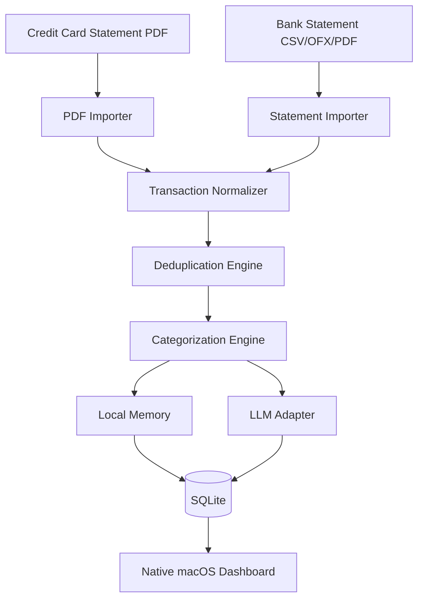

# Architecture

PocketLens is a native macOS SwiftUI app split into a thin UI layer and five domain-focused Swift packages. The goal is a **local-first, privacy-respecting** personal finance tool that works end-to-end without any network connection.

## High-Level Data Flow



## Module Layout

All domain logic lives in Swift Packages under `packages/`. The app target under `app/PocketLens` depends on all of them and contains only SwiftUI views, view models, and wiring.

| Package | Responsibility |
|---|---|
| `Domain` | Pure value types: entities (`Transaction`, `Merchant`, `Category`, `ImportBatch`, `Account`, `Card`, `CategorizationRule`, `UserCorrection`), enums, `Money` value type. No dependencies on persistence, UI, or networking. |
| `Persistence` | SQLite wrapper, schema migrations, repositories (one per entity), default-data seeding, aggregate queries for the dashboard. Hides the SQL library behind its own interface. |
| `Importing` | File intake (drag-and-drop, file picker, future folder watcher), PDF/CSV/OFX parsers, transaction normalization, deduplication engine, parser diagnostics. |
| `Categorization` | Priority-ordered categorization engine: user-correction memory → merchant alias → user rule → keyword rule → similarity → LLM suggestion → uncategorized. Emits confidence scores and reason strings. |
| `LLM` | `LLMProvider` protocol and concrete providers (mock, Ollama, OpenAI, Anthropic). Keychain-backed API keys. Redacts sensitive fields before any outbound call. |

## Dependency Direction

```
                 app/PocketLens
                       │
       ┌───────┬───────┼───────┬─────────┐
       ▼       ▼       ▼       ▼         ▼
  Categorization   Importing  LLM   Persistence
       │              │        │        │
       └──────────────┴────────┴────────┘
                      │
                      ▼
                   Domain
```

- `Domain` depends on nothing in the project.
- `Persistence`, `Importing`, `Categorization`, `LLM` all depend on `Domain`.
- `Persistence` additionally depends on an external SQLite library (GRDB.swift or SQLite.swift — decision deferred to Phase 1).
- `Categorization` depends on `Persistence` for reading memory and rules.
- `Importing` depends on `Persistence` for writing `ImportBatch` + transactions and on `Categorization` for categorizing parsed transactions.
- `LLM` depends only on `Domain` (it receives context objects, not raw DB access).
- The app target depends on all four feature packages.

## Build System

- **XcodeGen** generates `app/PocketLens.xcodeproj` from `app/project.yml` (the spec lives alongside the project so spec-dir = Xcode `SRCROOT`).
- The `.xcodeproj` file itself is **gitignored** — treat `app/project.yml` as the source of truth.
- `Makefile` targets: `make gen`, `make build`, `make test`, `make fmt`.
- Minimum macOS target: **14.0 Sonoma**.

## Why SQLite (not SwiftData)?

Chosen for:

- Portability — the database file can be opened by any SQLite tool for inspection.
- Open-source ergonomics — contributors without an Apple ecosystem can still read and reason about schema.
- Future-proofing — a CLI importer or self-hosted web variant can reuse the same DB.
- Migration control — explicit SQL migrations, not opaque schema diffs.

SwiftData may be reconsidered later as a convenience layer, but SQLite remains the canonical store.

## See Also

- [`data-model.md`](data-model.md) — authoritative SQLite schema.
- [`parsers.md`](parsers.md) — adding a parser.
- [`categorization.md`](categorization.md) — priority order and confidence.
- [`import-flow.md`](import-flow.md) — import lifecycle and dedup.
- [`privacy.md`](privacy.md) — data boundaries and LLM safety.
