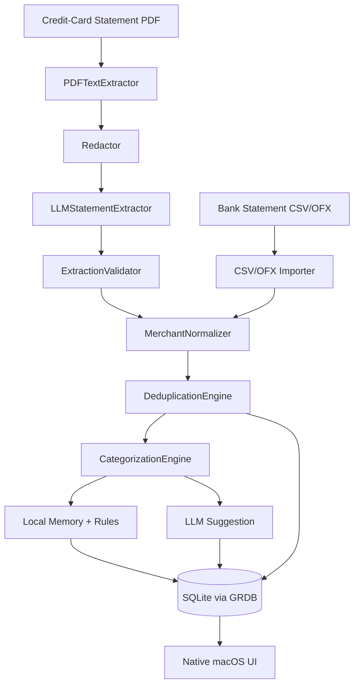

# Architecture

PocketLens is a native macOS SwiftUI app split into a thin UI layer and five domain-focused Swift packages. Storage is local; statement extraction in v0.1 depends on a cloud LLM (Claude). Local-LLM extraction (Ollama) is planned for v0.5.

## High-Level Data Flow



The LLM is **on the critical path for PDF extraction** in v0.1, and a **lower-priority assist** in the categorization chain (Phase 2+).

## Module Layout

All domain logic lives in Swift Packages under `packages/`. The app target under `app/PocketLens` depends on all of them and contains only SwiftUI views, view models, and wiring.

| Package | Responsibility |
|---|---|
| `Domain` | Pure value types: entities (`Transaction`, `Merchant`, `Category`, `ImportBatch`, `Account`, `Card`, `CategorizationRule`, `UserCorrection`), enums (`TransactionType`, `PurchaseMethod`, `Currency`), `Money` value type. No dependencies on persistence, UI, or networking. |
| `Persistence` | GRDB.swift wrapper, schema migrations, repositories (one per entity), default-data seeding, aggregate queries. Hides GRDB behind its own interface. |
| `Importing` | File intake (drag-and-drop, file picker, future folder watcher), PDF text extraction (PDFKit), `LLMStatementExtractor` orchestrator, validator, normalization, dedup, CSV/OFX importers (Phase 4). Depends on `LLM`. |
| `Categorization` | Priority-ordered categorization engine: user-correction memory → merchant alias → user rule → keyword rule → similarity → LLM suggestion (Phase 2+) → uncategorized. Emits confidence scores and reason strings. |
| `LLM` | `LLMProvider` protocol; `MockLLMProvider` + `AnthropicProvider` ship in Phase 1. `OllamaProvider` + `OpenAIProvider` in Phase 5. Owns the extraction prompt, tool schema, redactor, and Keychain-backed API key store. |

## Dependency Direction

```
                 app/PocketLens
                       │
       ┌───────┬───────┼───────┬─────────┐
       ▼       ▼       ▼       ▼         ▼
  Categorization   Importing  LLM   Persistence
       │              │        │        │
       └──────────────┴────────┴────────┘
                      │
                      ▼
                   Domain
```

- `Domain` depends on nothing in the project.
- `Persistence`, `Importing`, `Categorization`, `LLM` all depend on `Domain`.
- `Persistence` additionally depends on **GRDB.swift v6.x**.
- `Categorization` depends on `Persistence` for reading memory and rules, and on `LLM` (Phase 2+) for assist suggestions.
- `Importing` depends on `Persistence` for writing `ImportBatch` + transactions, on `Categorization` for categorizing extracted transactions, and on `LLM` for statement extraction (Phase 1).
- `LLM` depends only on `Domain` (it receives context objects, not raw DB access). It owns prompts, schema, redaction, and Keychain access.
- The app target depends on all four feature packages.

## Build System

- **XcodeGen** generates `app/PocketLens.xcodeproj` from `app/project.yml` (the spec lives alongside the project so spec-dir = Xcode `SRCROOT`).
- The `.xcodeproj` file itself is **gitignored** — treat `app/project.yml` as the source of truth.
- `Makefile` targets: `make gen`, `make build`, `make test`, `make test-integration` (real LLM calls; opt-in), `make fmt`.
- Minimum macOS target: **14.0 Sonoma**.
- App Sandbox is currently disabled (entitlements file is empty). Re-enable with explicit network + user-selected file entitlements when Phase 6 lands the folder watcher.

## Why SQLite (not SwiftData)?

Chosen for:

- Portability — the database file can be opened by any SQLite tool for inspection.
- Open-source ergonomics — contributors without an Apple ecosystem can still read and reason about schema.
- Future-proofing — a CLI importer or self-hosted web variant can reuse the same DB.
- Migration control — explicit SQL migrations, not opaque schema diffs.

SwiftData may be reconsidered later as a convenience layer, but SQLite remains the canonical store.

## See Also

- [`data-model.md`](data-model.md) — authoritative SQLite schema.
- [`parsers.md`](parsers.md) — adding a parser.
- [`categorization.md`](categorization.md) — priority order and confidence.
- [`import-flow.md`](import-flow.md) — import lifecycle and dedup.
- [`privacy.md`](privacy.md) — data boundaries and LLM safety.
